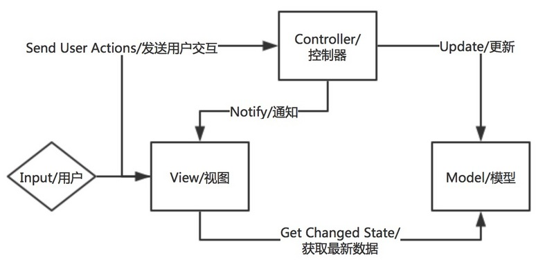
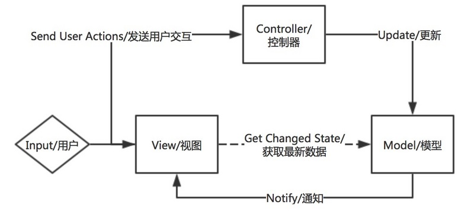
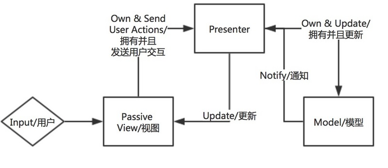
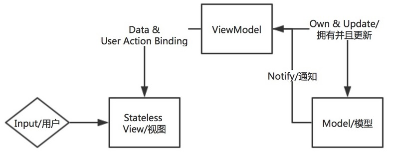

# MVVM模式

> MVVM 是前端一种非常流行的开发模式，利用 MVVM 模式可以使我们的代码更专注于处理业务逻辑而不是过多关注 DOM 操作。目前著名的 MVVM 框架有 Vue 、Angular 、Knockout 等，各有优势，但是实现的思想大致上是相同的：数据绑定及视图刷新。

## 演化之路

1. MVC(Model-View-Controller):

  -  View(视图层)

  -  Controller(业务逻辑层)

  -  Model(数据层)

  流程：

  - 用户交互进行输入

  - Controller将用户输入转化为Model所需要进行的更改

  - Model中的更改结束之后，Controller通知View进行更新以表现出当前Model的状态

  

  与观察者模式结合流程(会造成View和Model的强耦合)：

  - 用户交互进行输入

  - Controller将用户输入转化为Model所需要进行的更改

  - View作为Observer会监听Model中的更新，一旦有更新事件发出，View会自动触发更新以展示最新的Model状态

  

2. MVP(Model-View-Presenter)

  -  View(视图层)

  -  Controller(视图与数据的中间层)

  -  Model(数据层)

  流程(View与Model解耦)：

  - 用户交互进行输入

  - View将用户输入转化为发送给Presenter

  - Presenter控制Model的更新

  - Model将更新之后的值返回给Presenter

  - Presenter将更新之后的模型返回给View

  

3. MVVM(Model-View-ViewModel)

  -  View(视图层)

  -  ViewModel(视图与数据的中间层)

  -  Model(数据层)

  流程(View的无状态和数据绑定)：

  - 用户交互进行输入

  - View将数据直接传送给ViewModel，ViewModel保存这些状态数据

  - 在有需要的情况下，ViewModel会将数据传送给Model

  - Model在更新完成之后通知ViewModel

  - ViewModel从Model中获取最新的模型，并且更新自己的数据状态

  - View根据最新的ViewModel的数据进行重新渲染

  
