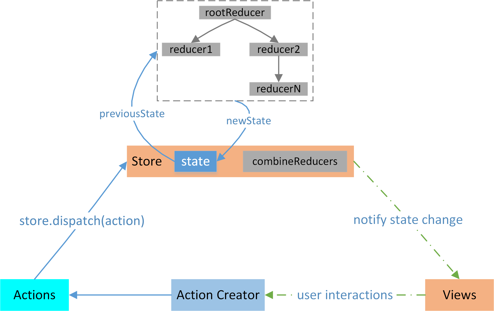
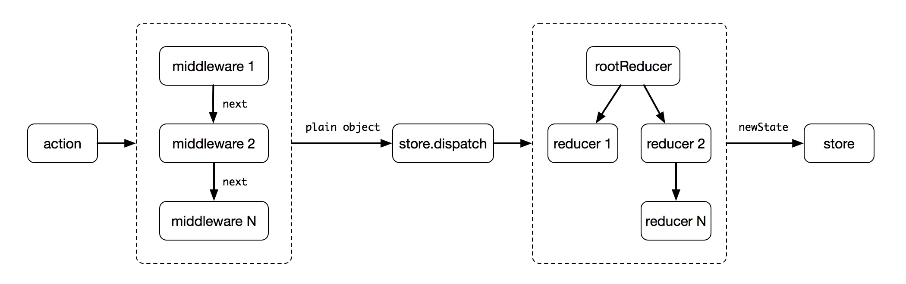
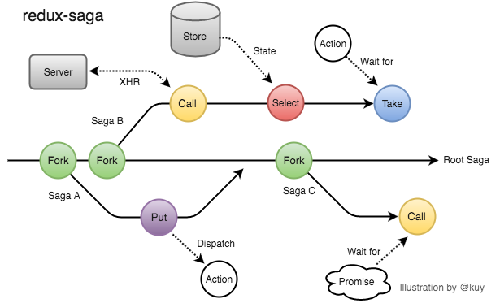

# Redux

> Redux 由 Flux 演变而来，并且引入了大量函数式编程的理念，提供可预测化的状态管理。

## 单向数据流

不同于Flux架构，Redux中没有dispatcher这个概念，并且Redux不允许直接操作数据，只能在reducer中返回新的对象来作为应用的新状态。但是它们都可以用(state, action) => newState来表述其核心思想，所以Redux可以被看成是Flux思想的一种实现，但是在细节上会有一些差异。


## 流程图



## 核心概念

- View 即 React 组件。它们负责渲染界面，捕获用户事件，从 Store 获取数据。

- Store 用于管理数据。需要特别注意 Redux 应用只有一个单一的 Store。

- Action 是传递给 Store.dispatch() 方法的对象，包含 Payload 和 Action Type。

- Action Type 指定了可以创建哪些 Action，Store 只会更新特定 Action Type 的 Action 触发的数据。

- Action Creator 是 Actions 的创建者，在 Redux 中只是简单的返回一个 action 对象。

- Reducer 用于指明应用如何更新 state 。Reducer 是一个纯函数，接收旧的 state 和 action，返回新的 state 。

## 概念解析

- Action：包含Action Type以及应用送往store(存储)的信息载荷(payload,也可称为有效信息)

  Action具有固定格式，即FSA, 全称为Flux Standard Action，格式如下:

  ```javascript

  {
    type: 'ADD_TODO',
    payload: {
      text: 'Do something'  
    }
  }

  ```
- Action Type : Action中的type , 如下：

  ```javascript

  {
    type: 'COMPLETE_TODO', //action type
    payload: {
      text: 'Do something'  
    }
  }

  ```

- Action Creator ：是一种辅助创建Action的函数，类似工厂模式，传入参数生成对应的Action ，如下所示：

  ```javascript

  function actionCreateor(text) {
    return {
      type: ADD_TODO,
      text
    }
  }

  ```

- Store : 用来维持应用所有的 state 树的一个对象。 改变 Store 内 state 的惟一途径是对它 dispatch 一个 action。有如下方法：

  - Store.getState()

    返回应用当前的 state 树

  - Store.dispatch(action)

    分发 action。这是触发 state 变化的惟一途径

  - Store.subscribe(listener)

    添加一个变化监听器。每当 dispatch action 的时候就会执行，state 树中的一部分可能已经变化。你可以在回调函数里调用 getState() 来拿到当前 state。如果需要解绑这个变化监听器，执行 subscribe 返回的函数即可。

  - Store.replaceReducer(nextReducer)

    替换 Store 当前用来计算 state 的 reducer。只有在你需要实现代码分隔，而且需要立即加载一些 reducer 的时候才可能会用到它。在实现 Redux 热加载机制的时候也可能会用到。

  ```javascript

    import { createStore } from 'redux'
    import todoApp from './reducers'

    //创建初始状态，并利用服务端数据初始化
    let store = createStore(todoApp, window.STATE_FROM_SERVER)

    // 打印初始状态
    console.log(store.getState())

    // 每次 state 更新时，打印日志
    // 注意 subscribe() 返回一个函数用来注销监听器
    let unsubscribe = store.subscribe(() =>
      console.log(store.getState())
    )

    //分发action
    store.dispatch(addTodo('Learn about Store'))

    // 停止监听 state 更新
    unsubscribe();

  ```

- Reducer : 一个纯函数，接收旧的 state 和 action，返回新的 state ，即 (state, action) => newState 。需要谨记 Reducer 一定要保持纯净。只要传入参数相同，返回计算得到的下一个 state 就一定相同。没有特殊情况、没有副作用，没有 API 请求、没有变量修改，单纯执行计算。

  ```javascript

  //简单的reducer,处理单一action
  function todoApp(state = initialState, action) {
    switch (action.type) {
      case SET_VISIBILITY_FILTER:
        //谨记不要直接修改state
        return Object.assign({}, state, {
          visibilityFilter: action.filter
        })
      default:
        return state
    }
  }

  //处理多个action，合并reducers
  import { combineReducers } from 'redux'
  import * as reducers from './reducers'

  const todoApp = combineReducers(reducers)

  ```

## 深入理解

- Middleware : 中间件。 在 Express 或者 Koa 服务端框架中，middleware 是指可以被嵌入在框架接收请求到产生响应过程之中的代码。而在 Redux 中，middleware 是指 action 被发起之后，到达 reducer 之前的代码，确切的说是dispatch之前的代码。middleware 最优秀的特性就是可以被链式组合，可以利用 Redux middleware 来进行日志记录、创建崩溃报告、调用异步接口或者路由等操作。如下所示：

 

  ```javascript

      //中间件的导入
      const store = createStore(reducers, initState, applyMiddleware(...middlewares))

      //applyMiddleware源码
      import compose from './compose'

      export default function applyMiddleware(...middlewares) {

        //enhancer是增强器的意思，这里即为应用中间件
        //这里涉及到函数柯里化
        //函数柯里化ES6表现：
        // const logger = store => next => action => {
        //   console.log('dispatching', action)
        //   let result = next(action)
        //   console.log('next state', store.getState())
        //   return result
        // }
        //
        // 等价于下面高阶函数：
        // function logger(store) {
        //   return function wrapDispatchToAddLogging(next) {
        //     return function dispatchAndLog(action) {
        //       console.log('dispatching', action)
        //       let result = next(action)
        //       console.log('next state', store.getState())
        //       return result
        //     }
        //   }
        // }

        return (createStore) => (reducer, preloadedState, enhancer) => {
          const store = createStore(reducer, preloadedState, enhancer)
          // 原先store.dispatch方法
          let dispatch = store.dispatch
          // 链数组，用于存放middleware
          let chain = []

          //暴露middlewareAPI给第三方中间件使用
          const middlewareAPI = {
            getState: store.getState,
            //applyMiddleware 执行完后，dispatch 会发生变化
            //匿名函数是为了只要 dispatch 更新了，middlewareAPI 中的 dispatch 应用也会发生变化
            dispatch: (...args) => dispatch(...args)
          }

          //通过map方法使中间件可以获取middlewareAPI
          chain = middlewares.map(middleware => middleware(middlewareAPI))

          //compose是FP(函数式编程)中常用方法，用于从右至左来组合函数
          //扩展dispatch方法，类似dispatch=f1(f2(f3(store.dispatch)))的效果
          //middleware内部dispatch方法改变，但不会影响原来store.dispatch方法
          //即dispatch为store.dispatch的高阶函数
          dispatch = compose(...chain)(store.dispatch)

          return {
            ...store,
            dispatch
          }
        }
      }

  ```

- Redux常用的middleware主要分为两大类: 异步处理中间件和路由跳转中间件。异步处理中间件以redux-saga为代表，路由跳转中间件以react-router-redux为代表。

  - redux-saga : 主要用来处理异步行为。saga 把副作用 (Side effect，异步行为就是典型的副作用) 看成”线程”，可以通过普通的action去触发它，当副作用完成时也会触发action作为输出。如下图所示，可以很直观得去理解saga :

   

   ```javascript
   // redux-saga 启动
    const sagaMiddleware = createSagaMiddleware();
    const store = createStore(rootReducer, [], compose(
          applyMiddleware(sagaMiddleware)
    );
    // 将 Saga 连接至外部的输入和 输 出,返回一个 Task 对象,类似 fork Effect 返回的
    sagaMiddleware.run(rootSaga);

   // redux-saga API/effect

   //put的作用和 redux 中的 dispatch 相同。
   yield put({
    type: SET_HOME_FEED,
    payload: homeFeed
  })

   //select获取 State 下数据。
   let homeFeed = yield select(state => state.homeFeed)

   //等待 Store 上指定的 action。
   const { payload: id } = yield take(FETCH_DETAIL_FEED)

   //redux-saga 可以用 fork 来调用子 saga ，其中 fork 是无阻塞型调用
   function* countSaga () {
      while (true) {
        const { payload: number } = yield take(BEGIN_COUNT);
        const countTaskId = yield fork(count, number);

        yield take(STOP_TASK);
        yield cancel(countTaskId);
      }
    }

    //redux-saga 也可以用 fork 来调用子 saga ，其中 call 是阻塞型调用
    const homeFeed = (yield call(homeService.fetchHomeFeed)).data

    const replyList = (yield call(detailService.fetchReplyList, id)).data

   ```
