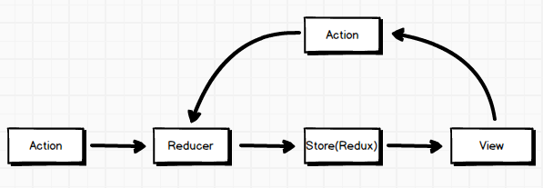

# Redux

> Redux 由 Flux 演变而来，并且引入了大量函数式编程的理念，提供可预测化的状态管理。

## 单向数据流

不同于Flux架构，Redux中没有dispatcher这个概念，并且Redux不允许直接操作数据，只能在reducer中返回新的对象来作为应用的新状态。但是它们都可以用(state, action) => newState来表述其核心思想，所以Redux可以被看成是Flux思想的一种实现，但是在细节上会有一些差异。



## 流程图


## 核心概念

- View 即 React 组件。它们负责渲染界面，捕获用户事件，从 Store 获取数据。

- Store 用于管理数据。需要特别注意 Redux 应用只有一个单一的 Store。

- Action 是传递给 Store.dispatch() 方法的对象，包含 Payload 和 Action Type。

- Action Type 指定了可以创建哪些 Action，Store 只会更新特定 Action Type 的 Action 触发的数据。

- Action Creator 是 Actions 的创建者，在 Redux 中只是简单的返回一个 action 对象。

- Reducer 用于指明应用如何更新 state 。Reducer 是一个纯函数，接收旧的 state 和 action，返回新的 state 。

## 概念解析

- Action：包含Action Type以及应用送往store(存储)的信息载荷(payload,也可称为有效信息)

  Action具有固定格式，即FSA, 全称为Flux Standard Action，格式如下:

  ```javascript

  {
    type: 'ADD_TODO',
    payload: {
      text: 'Do something'  
    }
  }

  ```
- Action Type : Action中的type , 如下：

  ```javascript

  {
    type: 'COMPLETE_TODO', //action type
    payload: {
      text: 'Do something'  
    }
  }

  ```

- Action Creator ：是一种辅助创建Action的函数，类似工厂模式，传入参数生成对应的Action ，如下所示：

  ```javascript

  function actionCreateor(text) {
    return {
      type: ADD_TODO,
      text
    }
  }

  ```

- Store : 用来维持应用所有的 state 树的一个对象。 改变 Store 内 state 的惟一途径是对它 dispatch 一个 action。有如下方法：

  - Store.getState()

    返回应用当前的 state 树

  - Store.dispatch(action)

    分发 action。这是触发 state 变化的惟一途径

  - Store.subscribe(listener)

    添加一个变化监听器。每当 dispatch action 的时候就会执行，state 树中的一部分可能已经变化。你可以在回调函数里调用 getState() 来拿到当前 state。如果需要解绑这个变化监听器，执行 subscribe 返回的函数即可。

  - Store.replaceReducer(nextReducer)

    替换 Store 当前用来计算 state 的 reducer。只有在你需要实现代码分隔，而且需要立即加载一些 reducer 的时候才可能会用到它。在实现 Redux 热加载机制的时候也可能会用到。

  ```javascript

    import { createStore } from 'redux'
    import todoApp from './reducers'

    //创建初始状态，并利用服务端数据初始化
    let store = createStore(todoApp, window.STATE_FROM_SERVER)

    // 打印初始状态
    console.log(store.getState())

    // 每次 state 更新时，打印日志
    // 注意 subscribe() 返回一个函数用来注销监听器
    let unsubscribe = store.subscribe(() =>
      console.log(store.getState())
    )

    //分发action
    store.dispatch(addTodo('Learn about Store'))

    // 停止监听 state 更新
    unsubscribe();

  ```

- Reducer : 一个纯函数，接收旧的 state 和 action，返回新的 state ，即 (state, action) => newState 。需要谨记 Reducer 一定要保持纯净。只要传入参数相同，返回计算得到的下一个 state 就一定相同。没有特殊情况、没有副作用，没有 API 请求、没有变量修改，单纯执行计算。

  ```javascript

  //简单的reducer,处理单一action
  function todoApp(state = initialState, action) {
    switch (action.type) {
      case SET_VISIBILITY_FILTER:
        //谨记不要直接修改state
        return Object.assign({}, state, {
          visibilityFilter: action.filter
        })
      default:
        return state
    }
  }

  //处理多个action，合并reducers
  import { combineReducers } from 'redux'
  import * as reducers from './reducers'

  const todoApp = combineReducers(reducers)

  ```
